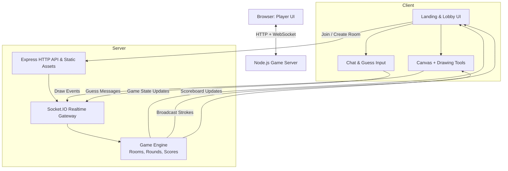
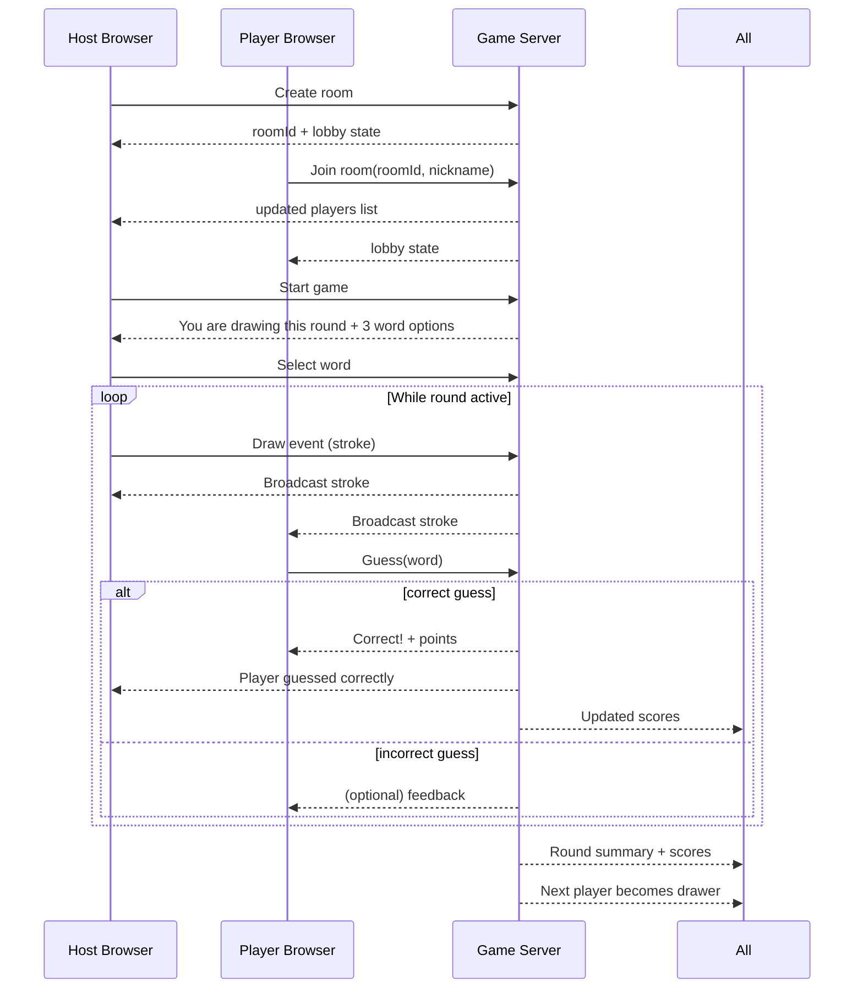

# devops-skribbl

## Overview

**devops-skribbl** is a real‑time, browser‑based drawing and guessing game inspired by [skribbl.io](https://skribbl.io/). One player draws a secret word on a shared canvas while the others race to guess it in the chat. The faster you guess correctly, the more points you get. After several rounds, the player with the highest score wins.

This repository is also designed as a **DevOps & AI‑assisted development playground**. The goals are:

- Build a small but complete web application (frontend + backend + realtime).
- Containerize it with Docker and run it locally via Docker Compose.
- Provide a Helm chart to deploy it on Kubernetes / OpenShift.
- Use **GitHub Spec Kit** together with **Claude AI** to drive the implementation in a spec‑driven way instead of “vibe coding”.

---

## Game Features (MVP)

**Core gameplay**

- Create and join private rooms via room code.
- Set basic room options: number of rounds and drawing time per round.
- Each round:
  - One player is the **drawer** and receives 3 word options.
  - The drawer picks one word and draws it on the shared canvas.
  - Other players see the drawing in real time and submit guesses via chat.
- Scoring:
  - Guessers get more points the faster they guess correctly.
  - The drawer gets points for each correct guess.
- At the end of all rounds the scoreboard shows the final ranking.

**User experience**

- Simple, responsive UI that works on desktop and tablet.
- Clean canvas area with:
  - Color palette
  - Brush size
  - Eraser
  - Clear canvas button
- Player list with current scores.
- Chat panel for guesses and system messages (round start, round end, correct guess notifications, etc.).

---

## Tech Stack (target)

The implementation is intentionally lightweight and focused on modern but approachable tools:

- **Backend**
  - Node.js
  - Express for HTTP and static file hosting
  - Socket.IO (or a similar WebSocket library) for real‑time game events
- **Frontend**
  - HTML5 + CSS3 + JavaScript
  - `<canvas>` for drawing
  - Lightweight state management in the client (no heavy framework required for MVP)
- **DevOps & Deployment**
  - Dockerfile for containerizing the app
  - `docker-compose.yml` for local multi‑container setup (app + future extras like Redis, etc.)
  - Helm chart for deployment on Kubernetes / OpenShift (with Route object for OpenShift)
- **AI‑assisted development**
  - GitHub Spec Kit to drive spec‑driven development
  - Claude AI (Claude Code) as the main coding agent

---

## High‑Level Architecture



### Round Flow (Sequence Diagram)



---

## Local Development

### Prerequisites

- Node.js (LTS or newer)
- npm or pnpm
- Docker & Docker Compose (optional but recommended)
- A running AI coding agent that supports Spec Kit (e.g. Claude Code)

### Run locally with Node.js

```bash
npm install
npm start
```

By default, the app should run on `http://localhost:3000`.

### Run locally with Docker Compose

```bash
docker compose up --build
```

Then open `http://localhost:3000` in your browser.

---

## Deploying to OpenShift with Helm

1. Build and push your application image to a registry accessible by your OpenShift cluster.
2. Update the Helm `values.yaml` with the correct image `repository` and `tag`.
3. Install the chart:

```bash
helm upgrade --install devops-skribbl ./chart \
  --namespace devops-skribbl --create-namespace
```

4. On OpenShift, a `Route` is created if `.Values.route.enabled` is `true`. After installation, check the route URL via the OpenShift console or `oc get routes`.

---

## Using GitHub Spec Kit with Claude AI

GitHub Spec Kit introduces a **spec‑driven development (SDD)** workflow, where you first write a clear specification and plan, then let the AI agent implement according to that spec. The typical flow is:

1. `/speckit.constitution` – Define project principles and non‑negotiables.
2. `/speckit.specify` – Turn a high‑level feature description into a detailed functional spec.
3. `/speckit.plan` – Turn the spec into a technical architecture and implementation plan.
4. `/speckit.tasks` – Break the plan into a prioritized list of actionable tasks.
5. `/speckit.implement` – Implement code guided by the tasks and the spec.  
   citeturn0search0turn0search3turn0search5turn0search10turn0search13

Below are **ready‑to‑use prompts** tailored for this project. The idea is:

- Open this repo in **Claude Code** (or another Spec Kit–aware IDE/agent).
- Run the corresponding `/speckit.*` command.
- Paste the prompt text as your message content.
- Let the agent generate or update the appropriate `.specify` artefacts.

You can modify these prompts as the project evolves.

---

## 1. Prompt for `/speckit.constitution` – Project Principles

> Use this after running `/speckit.constitution`.

```text
You are defining the project constitution for a small but production-minded web app called “devops-skribbl”.

This project is:
- A real-time, browser-based drawing & guessing game inspired by skribbl.io.
- A learning playground for DevOps, testing, and spec-driven development.
- Intended to be readable by junior developers and robust enough for real users.

Please create or update `.specify/memory/constitution.md` with a concise but opinionated set of principles that will guide all future specs, plans, tasks, and implementations for this repo.

Include principles in the following areas:

1. Code quality
   - Prefer clear, explicit code over clever abstractions.
   - Keep modules small, cohesive, and well-named.
   - Avoid premature optimization; optimize only when needed and measured.

2. Architecture & layering
   - Separate “game engine” logic (rounds, scoring, room state) from transport (Socket.IO events, HTTP).
   - Keep frontend rendering and client-side state manageable; avoid unnecessary frameworks for the MVP.
   - Make it easy to later add persistence (e.g. Redis, database) without rewriting the whole app.

3. Testing
   - Every core game rule (round transitions, scoring, turn rotation) must be covered by automated tests.
   - Prefer fast unit tests for game logic and light integration tests for WebSocket flows.
   - Include basic smoke tests for the HTTP and WebSocket endpoints.

4. UX & accessibility
   - UI must be clean, responsive, and accessible on desktop and tablet.
   - Use semantic HTML and basic ARIA roles where appropriate.
   - Avoid flashy animations that hurt readability or performance.

5. Performance & reliability
   - Keep the realtime experience smooth for 2–20 concurrent players per room.
   - Handle disconnects gracefully (e.g. drawer leaving mid-round).
   - Avoid blocking the event loop with CPU-heavy logic.

6. DevOps & maintainability
   - The app must always be runnable via `npm start`, Docker, and Helm.
   - Configuration must come from environment variables where appropriate.
   - Scripts and tooling should be documented in the README and/or SPEC docs.

7. AI-collaboration guidelines
   - Specs and plans are human-reviewed before large implementations.
   - AI should not delete important files or tests without explicit human approval.
   - Any major architectural change must first be reflected in the spec and plan.

Please write these principles as a clear, numbered or bulleted list so later /speckit.specify, /speckit.plan, /speckit.tasks, and /speckit.implement calls can rely on them.
```

---

## 2. Prompt for `/speckit.specify` – Game Specification

> Use this after running `/speckit.specify` for the overall MVP.

```text
We are specifying the MVP for “devops-skribbl”, a real-time drawing and guessing game inspired by skribbl.io.

Context:
- Players open the web app, choose a nickname, and either create a room or join an existing room via room code.
- The host can configure basic settings (round count, drawing time per round).
- In each round, one player is the drawer and everyone else guesses via a chat UI while watching the live drawing.
- Points are given for fast correct guesses; the drawer earns points when others guess correctly.
- At the end of all rounds, a scoreboard shows final standings.

Please create a detailed, structured functional specification in the appropriate Spec Kit location (for example `specs/001-devops-skribbl-mvp/spec.md`, or whatever folder structure Spec Kit uses by default) that covers:

1. Goals & Non-goals
   - What we absolutely want from the MVP.
   - What is explicitly out of scope (e.g. persistence across restarts, accounts, avatars, moderation tools).

2. Actors & user roles
   - Host player vs. regular player.
   - Optional: “observer” / “spectator” mode (can be future scope but mention it).

3. User flows
   - Landing → enter nickname → create room → lobby → start game.
   - Landing → enter nickname → join room → lobby → game.
   - Round lifecycle: choose word → drawing phase → guessing phase → scoring → next round → game end.
   - Error/edge cases: invalid room code, player disconnect, drawer leaving mid-round.

4. Functional requirements
   - Room management (create/join, max players, lobby behaviour).
   - Game loop (round count, player rotation as drawer, word selection).
   - Drawing canvas behaviour (stroke broadcasting, clear, color changes, brush size).
   - Guessing & chat (message handling, detection of correct guess, feedback).
   - Scoring rules (how many points for first, second, later guesses; what the drawer earns).
   - Final scoreboard and game-over behaviour.

5. Non-functional requirements
   - Performance expectations (latency, room size).
   - Basic accessibility expectations.
   - Reliability requirements for handling disconnects.

6. Future extensions (as “later” items, not required for MVP)
   - Optional features like avatars, profanity filters, custom word lists, user accounts.

Please structure the spec with clear headings, numbered lists, and explicit acceptance criteria for the MVP so that it can directly feed into `/speckit.plan`, `/speckit.tasks`, and `/speckit.implement`.
```

---

## 3. Prompt for `/speckit.plan` – Technical Plan

> Use this after there is a spec document for the MVP.

```text
We now have a functional spec for the “devops-skribbl” MVP (real-time drawing & guessing game). Please read the spec and the project constitution, then produce a technical implementation plan for this repository.

The target stack:
- Node.js backend with Express + Socket.IO (or equivalent WebSocket library).
- Frontend built with HTML/CSS/JavaScript using a `<canvas>` for drawing.
- Docker + Docker Compose for local runs.
- Helm chart for deployment on Kubernetes / OpenShift (Route for external access).

Please create or update the plan file (for example `specs/001-devops-skribbl-mvp/plan.md`) and include:

1. System architecture
   - High-level description of client–server interactions.
   - Explanation of how WebSocket events map to game actions (join, leave, start game, start round, draw stroke, guess, score update).
   - Where the in-memory game state lives and how rooms are isolated.

2. Module & directory structure
   - Suggested folder layout (e.g. `src/server`, `src/game`, `public/`, `chart/`, `scripts/`).
   - Separation between “transport layer” (Socket.IO event handlers), “game engine” (pure logic), and “HTTP + static assets”.
   - How to organize shared types / interfaces if applicable.

3. Data models
   - Room, Player, Round, DrawingStroke, ChatMessage, Score.
   - How these are represented in JS/TS (interfaces / types) and how they flow through the system.

4. Realtime protocol
   - Names and payload shapes for key WebSocket events (e.g. `room:join`, `room:update`, `game:start`, `round:state`, `draw:stroke`, `chat:message`, `guess:submit`, `score:update`, etc.).
   - Strategy for acknowledging or rejecting invalid events.

5. Game flow & orchestration
   - How server decides who is drawer each round.
   - How word options are generated and provided (e.g. from a local word list JSON).
   - How the timer is managed for each round, including broadcast of remaining time.

6. Testing strategy
   - What to cover with unit tests (e.g. scoring, round transitions).
   - What to cover with integration tests (e.g. basic WebSocket flows).
   - How tests are run locally and in CI.

7. DevOps plan
   - Dockerfile expectations (build vs. runtime, env vars).
   - Compose setup (services, ports).
   - Helm template structure, values, and how to plug into OpenShift Routes.

Please format the plan as a clear, multi-section document with enough detail so `/speckit.tasks` can break it down into actionable work and `/speckit.implement` can follow it without ambiguity.
```

---

## 4. Prompt for `/speckit.tasks` – Task Breakdown

> Use this after the plan is available and reasonably stable.

```text
We have a functional spec and a technical plan for the “devops-skribbl” MVP. Please read both, along with the constitution, and generate a detailed, prioritized task list for implementing the MVP in this repository.

Requirements for the task list:

1. Structure & format
   - Group tasks into major phases (e.g. “Game engine core”, “WebSocket API”, “Frontend UI”, “DevOps & deployment”, “Testing & polish”).
   - Within each phase, break work into small, actionable tasks that could be done in 30–90 minutes each.
   - Use a numbered or bullet list so humans can easily track progress.

2. Task content
   - Each task should:
     - Refer to specific files or directories when possible.
     - Be implementation-oriented, but still respect the plan and spec.
     - Mention any tests that should be added or updated as part of the task.

3. Dependencies & ordering
   - Make it clear which tasks depend on which others (e.g. “implement scoring engine only after core game state is in place”).
   - Identify an efficient sequence for an MVP, so that a partially complete implementation can still be demoed (e.g. basic room join + drawing before advanced scoring).

4. DevOps & CI tasks
   - Include tasks for Dockerfile, docker-compose, Helm chart for OpenShift, and basic CI scripts (even if CI itself is not fully implemented yet).
   - Include tasks for updating this README where helpful.

5. AI-implementation friendliness
   - Mark which tasks are “good candidates” to be handed to `/speckit.implement` (e.g. self-contained modules).
   - Keep descriptions explicit enough for an AI agent to implement them safely.

Please output the tasks in whatever file and format Spec Kit expects for `/speckit.tasks` (e.g. `specs/001-devops-skribbl-mvp/tasks.md`) and make sure they align tightly with the existing spec and plan.
```

---

## 5. Prompt for `/speckit.implement` – Guided Implementation

> Use this for specific implementation phases once specs, plan and tasks exist.

```text
We now want to implement a meaningful subset of the “devops-skribbl” MVP by following the spec, plan, and tasks.

Scope for this /speckit.implement call:
- Implement the **core game engine** and **basic realtime flows**:
  - In-memory models for Room, Player, Round, Scores.
  - The main game loop (round rotation, word selection, scoring).
  - Socket.IO event handlers for:
    - joining/leaving rooms,
    - starting a game,
    - starting a round,
    - broadcasting drawing strokes,
    - submitting guesses and assigning points,
    - broadcasting updated scores and round state.
- A minimal but functional frontend:
  - Landing + lobby UI.
  - Basic canvas with drawing tools.
  - Simple chat / guess input.
  - Real-time update of player list and scores.

Constraints and expectations:
- Follow the project constitution and the existing spec, plan, and tasks.
- Keep the code modular:
  - Put pure game logic into dedicated modules that can be unit-tested without Socket.IO.
  - Keep Socket.IO event registration and HTTP server bootstrap code thin and focused.
- Add or update tests where the tasks suggest them.
- Do NOT introduce heavy dependencies or frameworks unless the plan explicitly calls for them.
- Respect existing Dockerfile, docker-compose, and Helm structure (or adjust them carefully, updating documentation and tasks if necessary).

Please:
1. List which tasks from the tasks document you’re going to complete in this implementation step.
2. Implement those tasks by creating/updating files in this repo.
3. Summarize what changed and which tasks remain open at the end.

Focus on making the game playable end‑to‑end for a small group of friends using just a single Node.js process and in‑memory state.
```

---

## How to Use These Prompts

1. Make sure the repo is initialized with Spec Kit (see the official Spec Kit docs).
2. Open the project in your AI coding environment (e.g. Claude Code).
3. Run the corresponding `/speckit.*` command.
4. Paste the matching prompt from this README.
5. Review the generated spec/plan/tasks/implementation, commit what looks good, and iterate.

This README should give both humans and AI a clear picture of what **devops-skribbl** is and how to evolve it using Spec Kit and Claude AI.